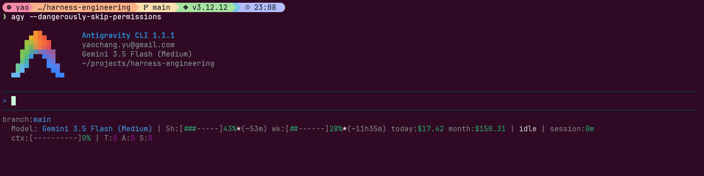

# Antigravity Statusline

[English](README.md) | [繁體中文](README.zh-TW.md)

A customizable Python statusline script for `antigravity-cli` (and Claude Code environments) that displays Git branch information, API rate limits, real-time spent costs, session duration, and active agent skills.



## Features

- **Git Status**: Displays the current branch, dirty status (`*`), and ahead/behind commits.
- **Rate Limits**: Shows used quotas and resets for 5-hour and Weekly limits with custom progress bars.
- **Cost Monitoring**: Shows today's and this month's cumulative API costs directly (no arbitrary limits).
- **Active Skills**: Dynamically parses the session transcript to show the currently running skill (e.g. `write-yaochangyu-style`).
- **ANSI Colors**: Consistent visual color schemes matching premium dark/gray themes.

## Prerequisites

- **Python 3**: The statusline renderer requires Python 3. You can verify if it's installed by running `python3 --version`.
  - On Ubuntu/Debian: `sudo apt update && sudo apt install -y python3`
  - On macOS: `brew install python`
  - On Windows (WSL): `sudo apt install python3`

## Installation

### 1. One-line Remote Installation (Recommended for Linux/macOS)

You can run the installer directly from GitHub using `curl` or `wget` without cloning the repository:

```bash
curl -sSL https://raw.githubusercontent.com/yaochangyu/antigravity-statusline/main/install.sh | bash
```

### 2. Windows / Cross-Platform Installation (Recommended for Windows)

If you are on Windows or prefer using Python directly:

**Remote installation via PowerShell or Command Prompt:**
```powershell
python -c "import urllib.request; exec(urllib.request.urlopen('https://raw.githubusercontent.com/yaochangyu/antigravity-statusline/main/install.py').read())"
```

**Or download and run the installer locally:**
```bash
python install.py
```

### 3. Local Installation (For Developers)

If you plan to customize the statusline, clone the repository and run the local installer:

**On Linux/macOS:**
```bash
git clone https://github.com/yaochangyu/antigravity-statusline.git
cd antigravity-statusline
chmod +x install.sh
./install.sh
```

**On Windows:**
```powershell
git clone https://github.com/yaochangyu/antigravity-statusline.git
cd antigravity-statusline
python install.py
```

## How It Works & Configuration

By default, `antigravity-cli` reads its settings from `~/.gemini/antigravity-cli/settings.json`. To execute a custom statusline script, the `"statusLine"` block must be configured to point to `statusline.py`.

The `install.sh` script automatically configures this for you. If you wish to configure it manually, add the following to your `settings.json`. You can also enable automatic updates by adding `"autoUpdate": true` inside `"statusLine"` block (this will automatically overwrite the copy in config folder when a new version is detected, preserving symlinks for developers):

```json
{
  "statusLine": {
    "type": "command",
    "command": "python3 ~/.gemini/antigravity-cli/scratch/statusline.py",
    "enabled": true,
    "autoUpdate": true
  }
}
```

## Update

The script features a background, non-blocking check that runs every 24 hours. If a new version is available on GitHub, an indicator badge `(🌟Update Available)` will be displayed on your statusline next to the session duration.

### 1. Remote Update
**On Linux/macOS:**
```bash
curl -sSL https://raw.githubusercontent.com/yaochangyu/antigravity-statusline/main/update.sh | bash
```

**On Windows:**
```powershell
python -c "import urllib.request; exec(urllib.request.urlopen('https://raw.githubusercontent.com/yaochangyu/antigravity-statusline/main/update.py').read())"
```

### 2. Local Update
Run the update script in the cloned repository directory:

*   **Linux/macOS:** `./update.sh`
*   **Windows:** `python update.py`

## Uninstallation

### 1. Remote Uninstallation
**On Linux/macOS:**
```bash
curl -sSL https://raw.githubusercontent.com/yaochangyu/antigravity-statusline/main/uninstall.sh | bash
```

**On Windows:**
```powershell
python -c "import urllib.request; exec(urllib.request.urlopen('https://raw.githubusercontent.com/yaochangyu/antigravity-statusline/main/uninstall.py').read())"
```

### 2. Local Uninstallation
Run the uninstaller script in the cloned repository directory:

*   **Linux/macOS:** `./uninstall.sh`
*   **Windows:** `python uninstall.py`
